# ESTADOS Y TRANSICIONES DEL DOMINIO — LOTERÍA BINARIA

**Versión:** 1.1.0  
**Estado:** **APROBADO Y CONGELADO** para implementación v1.  
**Ruta objetivo:** `docs/ESTADOS-Y-TRANSICIONES.md`  
**Reglas base:** `docs/REGLAS-NEGOCIO.md` v1.4.0  
**ADR aplicable:** `docs/DECISIONES-ARQUITECTURA/ADR-ORG-001-RESOLUCION-SORTEOS-USUARIOS.md`

> [!WARNING]
> En la fase académica, las recargas, conversiones, retiros, premios y saldos son simulados. Los estados definidos aquí sirven para construir y probar el sistema, pero no autorizan operaciones con dinero real ni sustituyen revisión legal, regulatoria, financiera o de seguridad.

## 0. Propósito

Este documento congela las máquinas de estado que deberá controlar el backend antes de crear el esquema SQL definitivo. Su finalidad es impedir:

- Transiciones decididas solamente en la web o la aplicación móvil.
- Estados imposibles o contradictorios.
- Doble compra, doble conversión, doble resultado, doble reembolso o doble premio.
- Reescritura destructiva del historial.
- Mezcla accidental entre la lotería oficial y los sorteos creados por usuarios.
- Uso de Redis, caché o `localStorage` como fuente de verdad.
- Creación de estados no respaldados por las reglas `LOT-*`.

Las máquinas de estado se derivan de las reglas aprobadas `LOT-*`, del Plan Técnico base v1.0 actualizado por `PLAN-TECNICO.md` v1.1.0 y de `ADR-ORG-001`. Cuando este documento introduce un estado de ejecución técnica —por ejemplo, `PROCESANDO` o `ERROR_REINTENTABLE`— ese estado no cambia la regla económica: solo permite ejecutar, reintentar y auditar el flujo con seguridad.

## 0.1 Autoridad documental

La precedencia aplicable es:

1. Documento Maestro de Reglas v1.0 y adendas aprobadas, incluido `ADR-ORG-001`.
2. `REGLAS-NEGOCIO.md` v1.4.0.
3. Contratos especializados aprobados: este documento, `FLUJOS-FINANCIEROS.md`, `MATRIZ-DE-PERMISOS.md` y `DICCIONARIO-DE-DATOS.md`, cada uno dentro de su materia.
4. `PLAN-TECNICO.md` v1.1.0 para arquitectura y orden de construcción.
5. OpenAPI, Prisma y migraciones.
6. Código y pruebas.
7. README como guía operativa.

Una contradicción debe resolverse documentalmente. No se permite “resolverla” mediante un `enum`, un valor por defecto o una condición improvisada en código.  
Referencias: `LOT-GOV-007`, `LOT-AUD-007`, `LOT-AUD-008`, `LOT-AUD-009`.

## 0.2 Convenciones

- Los estados se escriben en `MAYUSCULAS_CON_GUION_BAJO`.
- Los identificadores `TR-*` pertenecen únicamente a este documento y nombran transiciones.
- Los identificadores `LOT-*` son las reglas normativas que justifican cada transición.
- **Estado terminal:** no admite una transición ordinaria posterior.
- **Estado derivado:** se calcula desde datos autoritativos y no debe usarse como fuente independiente.
- **Transición atómica:** validación, cambio de estado, asientos, efectos y auditoría se confirman juntos.
- **Proceso:** API, worker o tarea administrativa autorizada.
- **Hora oficial:** reloj de PostgreSQL/servidor en UTC; presentación en `America/Guayaquil`.

## 0.3 Principios obligatorios para todas las máquinas

1. El cliente nunca envía el estado nuevo como autoridad. Envía un comando; el backend decide la transición.  
   Referencias: `LOT-GOV-001`, `LOT-IAM-006`.

2. PostgreSQL conserva el estado actual y el historial. Redis solo puede acelerar, avisar o coordinar de forma auxiliar.  
   Referencias: `LOT-GOV-002`, `LOT-AUD-005`.

3. Toda transición crítica utiliza transacción, bloqueo adecuado, restricción e idempotencia.  
   Referencias: `LOT-GOV-003`, `LOT-AUD-004`.

4. Un registro confirmado no se sobrescribe para “corregirlo”. Se registra una transición o una operación compensatoria.  
   Referencias: `LOT-GOV-004`, `LOT-FIN-005`, `LOT-FIN-012`.

5. La fecha de transición procede del servidor y se guarda en `timestamptz`.  
   Referencias: `LOT-GOV-005`.

6. Los estados terminales no se reabren salvo que una regla describa expresamente apelación, compensación o reparación.  
   Referencias: `LOT-GOV-004`, `LOT-ORG-021`.

7. Una transición administrativa exige actor, permiso reforzado cuando corresponda, motivo y auditoría.  
   Referencias: `LOT-IAM-005`, `LOT-AUD-001`, `LOT-AUD-003`.

8. La transición y sus efectos contables deben usar el mismo `correlation_id`.  
   Referencias: `LOT-FIN-012`, `LOT-AUD-001`.

## 0.4 Registro mínimo de historial

Toda entidad con ciclo de vida debe tener un historial inmutable, directamente o mediante un historial genérico. Campos mínimos:

| Campo | Propósito |
|---|---|
| `id` | Identificador del evento de estado. |
| `entity_type` | Tipo de agregado o entidad. |
| `entity_id` | Registro afectado. |
| `from_status` | Estado anterior; `NULL` en creación. |
| `to_status` | Estado nuevo. |
| `transition_code` | Identificador `TR-*`. |
| `actor_type` | `USER`, `ADMIN`, `WORKER`, `SYSTEM`. |
| `actor_user_id` | Actor humano cuando exista. |
| `active_mode` | Modo de sesión empleado cuando aplique. |
| `reason_code` | Motivo normalizado. |
| `reason_text` | Explicación obligatoria en acciones administrativas. |
| `correlation_id` | Correlación entre API, ledger, worker y auditoría. |
| `idempotency_key` | Clave de deduplicación cuando aplique. |
| `occurred_at` | Hora oficial de la transición. |
| `metadata` | Datos auxiliares no sensibles. |

Referencias: `LOT-EVT-020`, `LOT-AUD-001`, `LOT-AUD-002`, `LOT-AUD-003`.

## 1. Catálogo resumido de máquinas

| Código | Agregado o proceso | Máquina principal |
|---|---|---|
| IAM-ACC | Cuenta | Verificación, activación, suspensión, bloqueo y desactivación. |
| IAM-SES | Sesión | Apertura, expiración, revocación y cierre. |
| FIN-LED | Transacción contable | Contabilización y reverso compensatorio. |
| FIN-TOP | Recarga REAL simulada | Creación, confirmación simulada o fallo. |
| FIN-CON | Conversión VIRTUAL→REAL | Validación, procesamiento y finalización. |
| FIN-WDR | Retiro REAL simulado | Solicitud, revisión y finalización. |
| FIN-TRF | Transferencia VIRTUAL | Creación, confirmación o rechazo. |
| VND-PO | Compra mayorista | Orden, confirmación e inventario. |
| VND-REQ | Solicitud REAL→VIRTUAL | Pendiente, en proceso y finalización única. |
| EVT-TPL | Plantilla oficial | Borrador, activa, pausada e inactiva. |
| EVT-DRW | Evento oficial | Publicación, ventas, cierre, resultado e informe. |
| EVT-CMB | Combinación oficial | Disponible, reservada, vendida o bloqueada. |
| EVT-RES | Reserva oficial | Activa, consumida, expirada o liberada. |
| EVT-ORD | Orden de compra | Pendiente, procesando, confirmada o rechazada. |
| EVT-TKT | Boleto | Ciclo de propiedad, evaluación y acreditación. |
| PRZ-FND | Reserva de fondo | Pendiente, reservada, consumida o liberada. |
| PRZ-DRAW | Resultado oficial | Commitment, snapshot, fijación, evaluación e informe. |
| PRZ-AWD | Orden de premio | Calculada, acreditando, acreditada o revisión. |
| ORG-DRW | Sorteo creado por usuario | Publicación, ventas, resultado, entrega y cierre. |
| ORG-PAR | Participación | Pago, relación, elegibilidad y asignación separadas. |
| ORG-COD | Código privado | Emitido, reclamado o expirado. |
| ORG-CLM | Reclamo | Presentado, revisión, resolución, apelación y cierre. |
| ORG-DLV | Entrega del premio | Pendiente, registrada, confirmada o en disputa. |
| ORG-ESC | Custodia del 95 % | Retenida, liberable, liberada o reembolsada. |
| SYS-JOB | Trabajo persistente | Programado, ejecutando, reintento, éxito o intervención. |

---

# 2. Identidad, cuentas y sesiones

## 2.1 Máquina `IAM-ACC` — Estado de cuenta

Estados normativos:

- `PENDIENTE_VERIFICACION`
- `ACTIVO`
- `SUSPENDIDO`
- `BLOQUEADO`
- `DESACTIVADO`

Solo `ACTIVO` puede iniciar nuevas operaciones de negocio. Ningún estado borra el historial.  
Referencias: `LOT-IAM-007`, `LOT-IAM-008`, `LOT-IAM-009`.

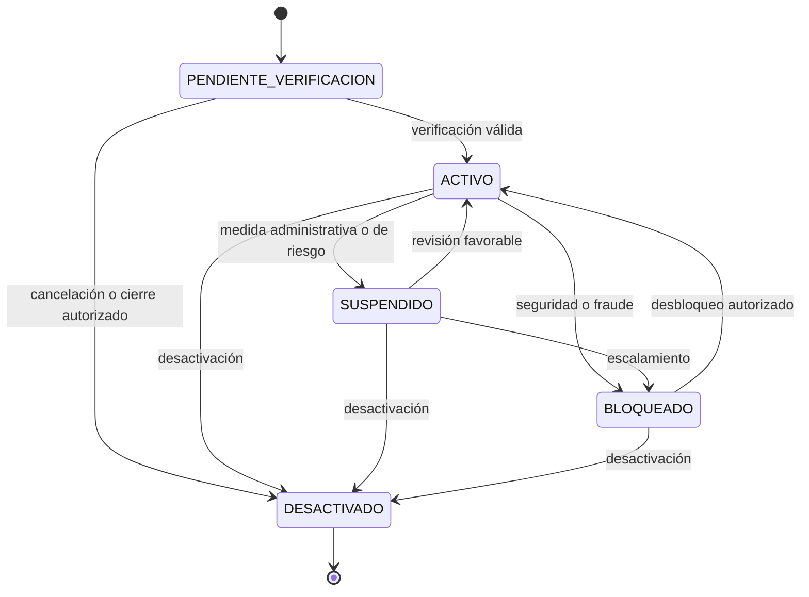
```mermaid
stateDiagram-v2
    [*] --> PENDIENTE_VERIFICACION
    PENDIENTE_VERIFICACION --> ACTIVO: verificación válida
    PENDIENTE_VERIFICACION --> DESACTIVADO: cancelación o cierre autorizado
    ACTIVO --> SUSPENDIDO: medida administrativa o de riesgo
    ACTIVO --> BLOQUEADO: seguridad o fraude
    SUSPENDIDO --> ACTIVO: revisión favorable
    SUSPENDIDO --> BLOQUEADO: escalamiento
    BLOQUEADO --> ACTIVO: desbloqueo autorizado
    ACTIVO --> DESACTIVADO: desactivación
    SUSPENDIDO --> DESACTIVADO: desactivación
    BLOQUEADO --> DESACTIVADO: desactivación
    DESACTIVADO --> [*]
```

| Transición | Desde | Hacia | Actor | Guardas y efectos | Reglas |
|---|---|---|---|---|---|
| `TR-IAM-001` | `NULL` | `PENDIENTE_VERIFICACION` | Sistema | Registro válido, unicidad y términos versionados. | `LOT-IAM-007` |
| `TR-IAM-002` | `PENDIENTE_VERIFICACION` | `ACTIVO` | Sistema | Correo/teléfono verificados según alcance; mayoría de edad validada. | `LOT-IAM-007`, `LOT-IAM-008` |
| `TR-IAM-003` | `ACTIVO` | `SUSPENDIDO` | Administrador/sistema de riesgo | Motivo obligatorio; bloquea operaciones nuevas. | `LOT-IAM-005`, `LOT-IAM-008`, `LOT-AUD-003` |
| `TR-IAM-004` | `ACTIVO`, `SUSPENDIDO` | `BLOQUEADO` | Administrador/sistema de seguridad | Evidencia o señal de riesgo; revocación de sesiones cuando proceda. | `LOT-IAM-008`, `LOT-AUD-001` |
| `TR-IAM-005` | `SUSPENDIDO`, `BLOQUEADO` | `ACTIVO` | Administrador autorizado | Revisión favorable y motivo. | `LOT-IAM-005`, `LOT-AUD-003` |
| `TR-IAM-006` | Cualquier no terminal | `DESACTIVADO` | Usuario o Administrador | No elimina datos; conserva ledger, boletos, códigos y reclamos. | `LOT-IAM-009`, `LOT-GOV-004` |

**Prohibiciones:**

- `DESACTIVADO → ACTIVO` no forma parte del MVP. Una restauración futura requiere decisión y prueba nuevas.
- Suspender o bloquear no altera asientos, resultados ni registros ya confirmados.
- Una operación pendiente no se resuelve automáticamente por el estado de cuenta; cada máquina aplica sus reglas de cancelación, compensación o finalización.

## 2.2 Máquina `IAM-SES` — Sesión

Estados técnicos mínimos:

- `ABIERTA`
- `EXPIRADA`
- `REVOCADA`
- `CERRADA`

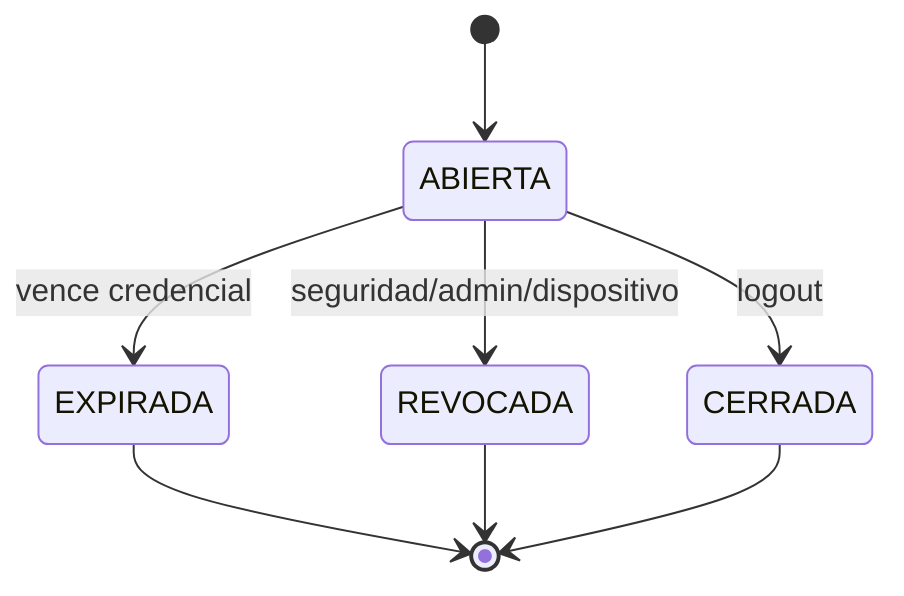
```mermaid
stateDiagram-v2
    [*] --> ABIERTA
    ABIERTA --> EXPIRADA: vence credencial
    ABIERTA --> REVOCADA: seguridad/admin/dispositivo
    ABIERTA --> CERRADA: logout
    EXPIRADA --> [*]
    REVOCADA --> [*]
    CERRADA --> [*]
```

El **modo activo** no es un estado de la cuenta; es un atributo de la sesión. Valores permitidos:

- `CLIENTE`
- `VENDEDOR`
- `ADMINISTRADOR`
- `CLIENTE_FINANCIERO`

| Transición | Regla |
|---|---|
| Abrir sesión | Autenticación válida y cuenta `ACTIVO`. |
| Cambiar modo | La sesión permanece `ABIERTA`; el backend verifica roles, permisos, recurso y estado. |
| Revocar | Debe impedir refresh posterior en ese dispositivo. |
| Expirar | No borra datos locales autoritativos porque no existen. |

Referencias: `LOT-IAM-001`, `LOT-IAM-002`, `LOT-IAM-004`, `LOT-IAM-005`, `LOT-IAM-006`.

---

# 3. Finanzas y libro contable

## 3.1 Máquina `FIN-LED` — Transacción contable

Una transacción contable persistida no debe permanecer parcialmente contabilizada.

Estados:

- `CONTABILIZADA`
- `PARCIALMENTE_REVERSADA`
- `REVERSADA`

Ningún estado permite editar asientos anteriores. `PARCIALMENTE_REVERSADA` o `REVERSADA` se alcanzan únicamente después de contabilizar transacciones compensatorias enlazadas a la original.

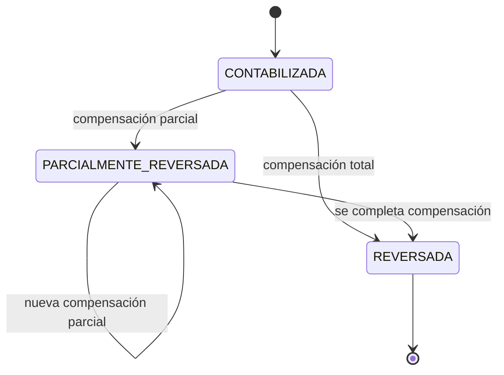
```mermaid
stateDiagram-v2
    [*] --> CONTABILIZADA
    CONTABILIZADA --> PARCIALMENTE_REVERSADA: compensación parcial
    CONTABILIZADA --> REVERSADA: compensación total
    PARCIALMENTE_REVERSADA --> PARCIALMENTE_REVERSADA: nueva compensación parcial
    PARCIALMENTE_REVERSADA --> REVERSADA: se completa compensación
    REVERSADA --> [*]
```

Invariantes:

- Débitos = créditos por unidad.
- REAL y VIRTUAL nunca se balancean entre sí.
- El ledger es la fuente de verdad; la proyección puede repararse.
- No se permite `UPDATE` de montos confirmados.
- Un fallo previo al `COMMIT` no crea una transacción `CONTABILIZADA`.
- La suma acumulada de compensaciones por asiento original nunca puede superar su importe.
- Una transacción original solo queda `REVERSADA` cuando todos sus efectos fueron compensados; de lo contrario queda `PARCIALMENTE_REVERSADA`.

Referencias: `LOT-FIN-001`, `LOT-FIN-005`, `LOT-FIN-006`, `LOT-FIN-007`, `LOT-FIN-012`, `LOT-GOV-003`, `LOT-GOV-004`.

## 3.2 Saldos de wallet

`DISPONIBLE`, `RESERVADO`, `PENDIENTE`, `BLOQUEADO` y `EN_RETIRO` son **componentes de saldo**, no estados mutuamente excluyentes de una wallet. Una wallet puede tener valores simultáneos en varios componentes.

La wallet no debe usar un único `status` para representar esos saldos.  
Referencias: `LOT-FIN-001`, `LOT-FIN-004`, `LOT-FIN-006`.

### Política monetaria común

Toda máquina que divida un monto porcentualmente usa la política congelada de `LOT-FIN-013`: minor units, pisos enteros, método de mayores residuos y prioridad determinista. Esta política es parte de la transición financiera y debe quedar identificada en el registro de cálculo.

La compra mayorista del Vendedor solo acepta incrementos de `1,00 VIRTUAL`, por lo que la relación `0,90 REAL → 1,00 VIRTUAL` permanece exacta.

## 3.3 Máquina `FIN-TOP` — Recarga REAL simulada

Estados mínimos del MVP:

- `CREADA`
- `CONFIRMADA_SIMULADA`
- `FALLIDA`

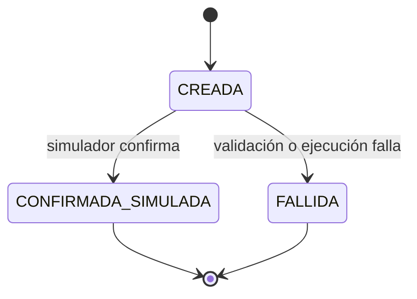
```mermaid
stateDiagram-v2
    [*] --> CREADA
    CREADA --> CONFIRMADA_SIMULADA: simulador confirma
    CREADA --> FALLIDA: validación o ejecución falla
    CONFIRMADA_SIMULADA --> [*]
    FALLIDA --> [*]
```

| Transición | Efecto |
|---|---|
| `TR-FIN-TOP-001` | Crear solicitud sin acreditar saldo. |
| `TR-FIN-TOP-002` | Crear ledger REAL 1:1 y marcar `CONFIRMADA_SIMULADA` en la misma transacción. |
| `TR-FIN-TOP-003` | Marcar `FALLIDA` sin asientos de acreditación. |

Referencias: `LOT-FIN-008`, `LOT-GOV-003`, `LOT-GOV-008`.

## 3.4 Máquina `FIN-CON` — Conversión VIRTUAL→REAL

Estados:

- `CREADA`
- `PROCESANDO`
- `COMPLETADA`
- `RECHAZADA`
- `ERROR_REINTENTABLE`
- `REVISION_MANUAL`

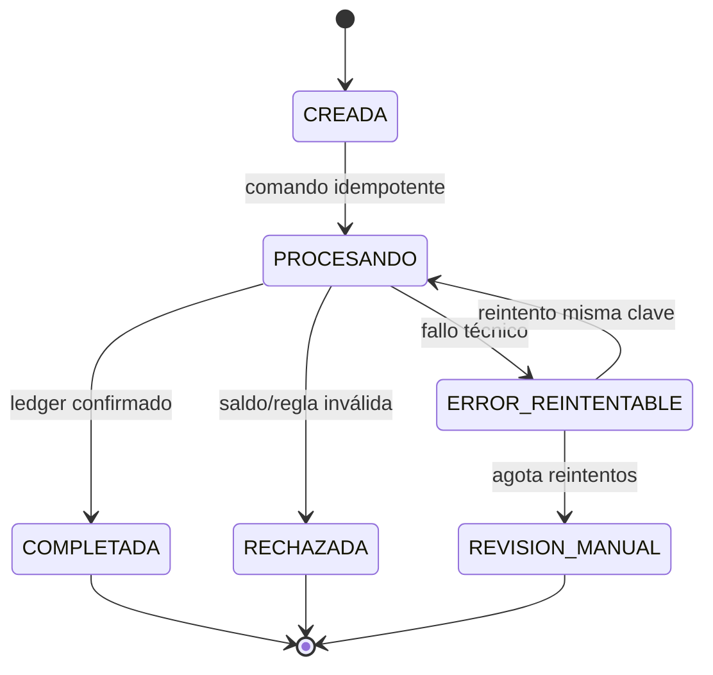
```mermaid
stateDiagram-v2
    [*] --> CREADA
    CREADA --> PROCESANDO: comando idempotente
    PROCESANDO --> COMPLETADA: ledger confirmado
    PROCESANDO --> RECHAZADA: saldo/regla inválida
    PROCESANDO --> ERROR_REINTENTABLE: fallo técnico
    ERROR_REINTENTABLE --> PROCESANDO: reintento misma clave
    ERROR_REINTENTABLE --> REVISION_MANUAL: agota reintentos
    COMPLETADA --> [*]
    RECHAZADA --> [*]
    REVISION_MANUAL --> [*]
```

Guardas:

- Cuenta `ACTIVO`.
- VIRTUAL disponible suficiente.
- Comisión exacta del 10 %.
- No aceptar montos del cliente como saldo autoritativo.
- Un único ledger por clave idempotente.

Referencias: `LOT-FIN-009`, `LOT-FIN-012`, `LOT-FIN-013`, `LOT-GOV-003`.

## 3.5 Máquina `FIN-WDR` — Retiro REAL simulado

Estados del MVP académico:

- `SOLICITADO`
- `EN_REVISION`
- `APROBADO`
- `COMPLETADO_SIMULADO`
- `RECHAZADO`
- `ERROR_REINTENTABLE`
- `REVISION_MANUAL`

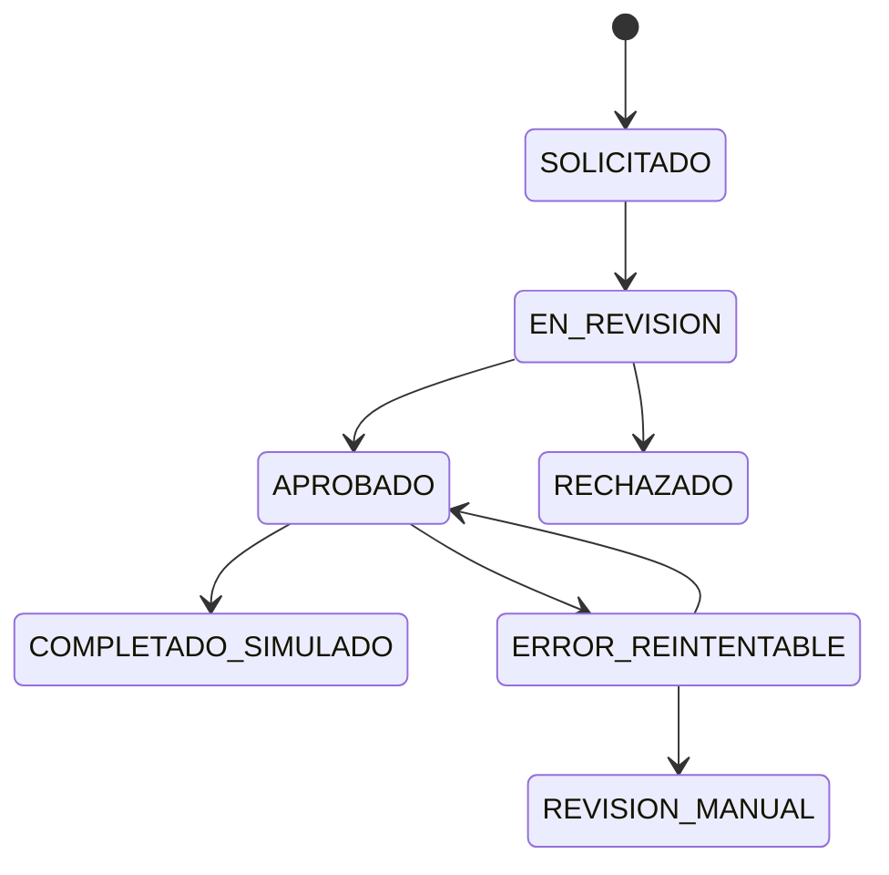
```mermaid
stateDiagram-v2
    [*] --> SOLICITADO
    SOLICITADO --> EN_REVISION
    EN_REVISION --> APROBADO
    EN_REVISION --> RECHAZADO
    APROBADO --> COMPLETADO_SIMULADO
    APROBADO --> ERROR_REINTENTABLE
    ERROR_REINTENTABLE --> APROBADO
    ERROR_REINTENTABLE --> REVISION_MANUAL
```

Reglas:

- El monto pasa de disponible a `EN_RETIRO` al aceptar la solicitud.
- No se cobra una segunda comisión de negocio.
- `COMPLETADO_SIMULADO` no representa pago bancario real.
- Un rechazo libera el monto reservado.
- La integración con un proveedor real requerirá una nueva versión de esta máquina.

Referencias: `LOT-FIN-003`, `LOT-FIN-010`, `LOT-GOV-008`.

## 3.6 Máquina `FIN-TRF` — Transferencia VIRTUAL

Estados:

- `CREADA`
- `PROCESANDO`
- `COMPLETADA`
- `RECHAZADA`
- `ERROR_REINTENTABLE`
- `REVISION_MANUAL`

La transferencia financiera ocurre en una sola transacción; no existe estado durable “medio debitada”. Un error técnico puede conservar el comando para reintento, pero nunca deja un débito o crédito parcial contabilizado.

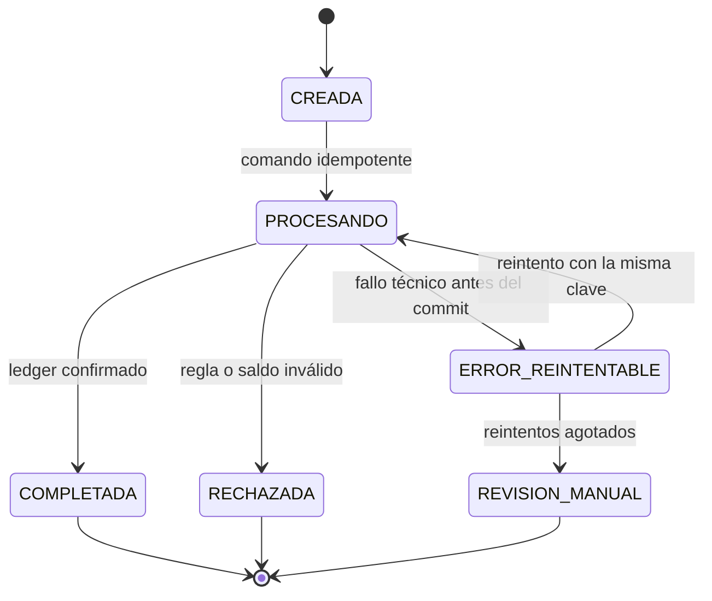
```mermaid
stateDiagram-v2
    [*] --> CREADA
    CREADA --> PROCESANDO: comando idempotente
    PROCESANDO --> COMPLETADA: ledger confirmado
    PROCESANDO --> RECHAZADA: regla o saldo inválido
    PROCESANDO --> ERROR_REINTENTABLE: fallo técnico antes del commit
    ERROR_REINTENTABLE --> PROCESANDO: reintento con la misma clave
    ERROR_REINTENTABLE --> REVISION_MANUAL: reintentos agotados
    COMPLETADA --> [*]
    RECHAZADA --> [*]
    REVISION_MANUAL --> [*]
```

Guardas:

- Emisor y destinatario `ACTIVO`.
- Ambos son clientes autorizados para el flujo.
- Emisor distinto del destinatario.
- Saldo VIRTUAL disponible.
- Idempotencia.
- `ERROR_REINTENTABLE` solo existe cuando no se confirmó un ledger parcial.
- El reintento reutiliza la misma clave y devuelve el efecto existente cuando ya fue contabilizado.

Referencias: `LOT-FIN-004`, `LOT-FIN-011`, `LOT-FIN-012`, `LOT-GOV-003`, `LOT-AUD-004`.

---

# 4. Vendedores y solicitudes REAL→VIRTUAL

## 4.1 Máquina `VND-PO` — Compra mayorista del Vendedor

Estados:

- `CREADA`
- `PROCESANDO`
- `CONFIRMADA`
- `RECHAZADA`
- `FALLIDA`

`CONFIRMADA` debe crear simultáneamente:

- Débito REAL del Vendedor.
- Crédito REAL de plataforma.
- Débito/emisión VIRTUAL técnica.
- Crédito VIRTUAL del Vendedor.
- Lote de inventario con coste 0,90.
- Ganancia potencial, no realizada.

Referencias: `LOT-VND-001`, `LOT-VND-002`, `LOT-FIN-005`, `LOT-FIN-012`, `LOT-FIN-013`.

## 4.2 Máquina `VND-REQ` — Solicitud del Cliente

Estados autoritativos:

- `PENDIENTE`
- `EN_PROCESO`
- `COMPLETADA_POR_VENDEDOR`
- `COMPLETADA_POR_PLATAFORMA`
- `FALLIDA_POR_LIQUIDEZ`

No existe conversión directa inmediata del Cliente.

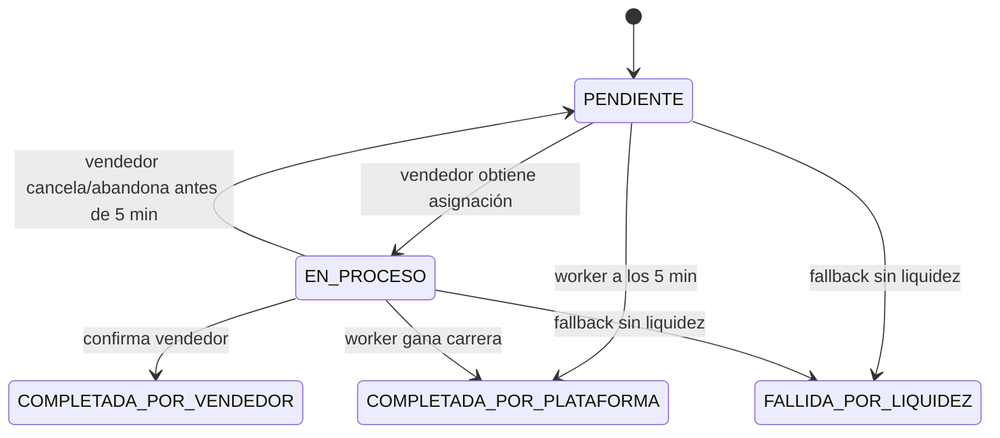
```mermaid
stateDiagram-v2
    [*] --> PENDIENTE
    PENDIENTE --> EN_PROCESO: vendedor obtiene asignación
    EN_PROCESO --> PENDIENTE: vendedor cancela/abandona antes de 5 min
    EN_PROCESO --> COMPLETADA_POR_VENDEDOR: confirma vendedor
    PENDIENTE --> COMPLETADA_POR_PLATAFORMA: worker a los 5 min
    EN_PROCESO --> COMPLETADA_POR_PLATAFORMA: worker gana carrera
    PENDIENTE --> FALLIDA_POR_LIQUIDEZ: fallback sin liquidez
    EN_PROCESO --> FALLIDA_POR_LIQUIDEZ: fallback sin liquidez
```

| Transición | Guardas | Efectos atómicos | Reglas |
|---|---|---|---|
| `TR-VND-REQ-001` | Cliente `ACTIVO`, REAL suficiente. | Reservar REAL; crear solicitud `PENDIENTE`; programar fallback a `created_at + 5 min`. | `LOT-VND-003`, `LOT-GOV-005` |
| `TR-VND-REQ-002` | Vendedor visible, activo, saldo suficiente y no relacionado. | Lock de solicitud; crear asignación activa; `PENDIENTE → EN_PROCESO`. | `LOT-VND-004`, `LOT-VND-005` |
| `TR-VND-REQ-003` | Asignación activa y aún dentro del plazo. | Liberar asignación; conservar REAL reservado; volver a `PENDIENTE`. | `LOT-VND-006`, `LOT-VND-008` |
| `TR-VND-REQ-004` | Vendedor y solicitud bloqueados; no completada. | VIRTUAL vendedor→cliente; REAL reservado cliente→vendedor; venta e inventario; terminal. | `LOT-VND-007`, `LOT-VND-010` |
| `TR-VND-REQ-005` | Hora oficial ≥ creación + 5 min; no completada. | VIRTUAL wallet general→cliente; REAL reservado→plataforma; terminal. | `LOT-VND-009`, `LOT-VND-010` |
| `TR-VND-REQ-006` | Fallback vencido y wallet general insuficiente. | Liberar REAL al Cliente; crear alerta; terminal. | `LOT-VND-010` |

**Regla de carrera:** `COMPLETADA_POR_VENDEDOR`, `COMPLETADA_POR_PLATAFORMA` y `FALLIDA_POR_LIQUIDEZ` son terminales mutuamente excluyentes. Debe existir una restricción de finalización única.  
Referencias: `LOT-GOV-003`, `LOT-AUD-004`, `LOT-AUD-005`.

## 4.3 Asignación del Vendedor

La asignación se modela separadamente:

- `ACTIVA`
- `LIBERADA`
- `CONSUMIDA`
- `CERRADA_SIN_EFECTO`

| Estado final | Significado |
|---|---|
| `LIBERADA` | El Vendedor canceló o abandonó antes del límite. |
| `CONSUMIDA` | La solicitud se completó por ese Vendedor. |
| `CERRADA_SIN_EFECTO` | Plataforma u otro proceso finalizó la solicitud primero. |

La asignación nunca amplía los cinco minutos.  
Referencias: `LOT-VND-005`, `LOT-VND-006`, `LOT-VND-008`, `LOT-VND-010`.

---

# 5. Lotería oficial: plantillas, eventos y compras

## 5.1 Máquina `EVT-TPL` — Plantilla/autogenerador

Estados técnicos:

- `BORRADOR`
- `ACTIVA`
- `PAUSADA`
- `INACTIVA`

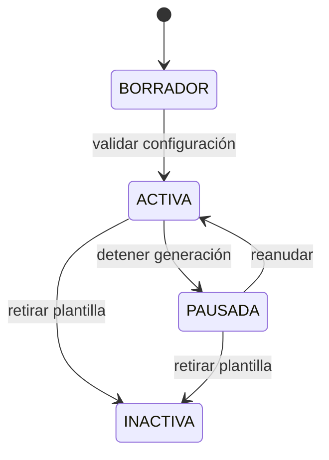
```mermaid
stateDiagram-v2
    [*] --> BORRADOR
    BORRADOR --> ACTIVA: validar configuración
    ACTIVA --> PAUSADA: detener generación
    PAUSADA --> ACTIVA: reanudar
    ACTIVA --> INACTIVA: retirar plantilla
    PAUSADA --> INACTIVA: retirar plantilla
```

Guardas:

- Una plantilla activa no puede generar dos eventos para el mismo slot.
- Sus cambios solo afectan eventos futuros no publicados y sin ventas.
- La falta de cobertura impide publicar eventos, aunque la plantilla permanezca activa.

Referencias: `LOT-EVT-008`, `LOT-EVT-009`, `LOT-GOV-007`.

## 5.2 Máquina `EVT-DRW` — Evento oficial

Estados:

- `BORRADOR`
- `PROGRAMADO`
- `PUBLICADO`
- `VENTAS_ABIERTAS`
- `VENTAS_CERRADAS`
- `CONGELADO`
- `RESULTADO_FIJADO`
- `PREMIOS_CALCULADOS`
- `INFORME_PUBLICADO`
- `FINALIZADO`
- `CANCELADO`

`AGOTADO` se trata como **estado derivado de disponibilidad**, no como fase autoritativa. Puede cambiar si una reserva expira antes del cierre.

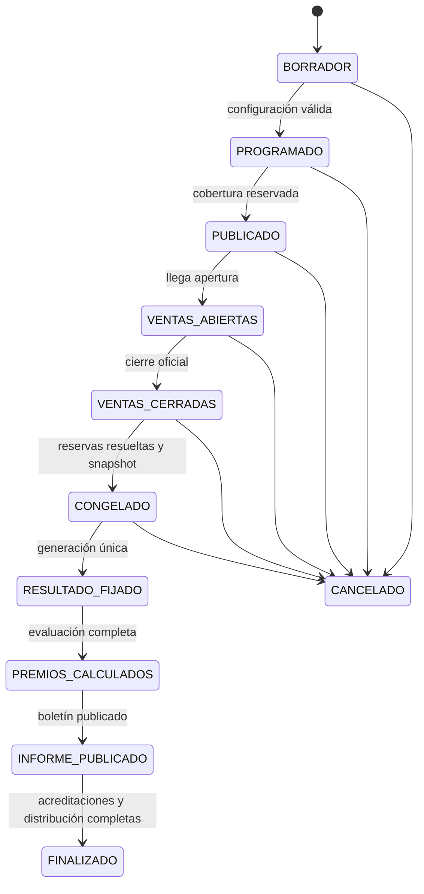
```mermaid
stateDiagram-v2
    [*] --> BORRADOR
    BORRADOR --> PROGRAMADO: configuración válida
    PROGRAMADO --> PUBLICADO: cobertura reservada
    PUBLICADO --> VENTAS_ABIERTAS: llega apertura
    VENTAS_ABIERTAS --> VENTAS_CERRADAS: cierre oficial
    VENTAS_CERRADAS --> CONGELADO: reservas resueltas y snapshot
    CONGELADO --> RESULTADO_FIJADO: generación única
    RESULTADO_FIJADO --> PREMIOS_CALCULADOS: evaluación completa
    PREMIOS_CALCULADOS --> INFORME_PUBLICADO: boletín publicado
    INFORME_PUBLICADO --> FINALIZADO: acreditaciones y distribución completas

    BORRADOR --> CANCELADO
    PROGRAMADO --> CANCELADO
    PUBLICADO --> CANCELADO
    VENTAS_ABIERTAS --> CANCELADO
    VENTAS_CERRADAS --> CANCELADO
    CONGELADO --> CANCELADO
```

| Transición | Guardas | Efectos | Reglas |
|---|---|---|---|
| `TR-EVT-001` | Producto y versión válidos. | Crear evento y catálogo planificado. | `LOT-EVT-002`, `LOT-EVT-003`, `LOT-GOV-007` |
| `TR-EVT-002` | Configuración completa. | Programar horas oficiales. | `LOT-GOV-005`, `LOT-EVT-008` |
| `TR-EVT-003` | Cobertura de garantía reservada. | Publicar datos inmutables. | `LOT-EVT-007`, `LOT-EVT-009`, `LOT-PRZ-007` |
| `TR-EVT-004` | Hora oficial ≥ apertura y < cierre. | Habilitar compra. | `LOT-EVT-006`, `LOT-GOV-005` |
| `TR-EVT-005` | Hora oficial = sorteo − 10 min. | Rechazar nuevas compras/reservas. | `LOT-EVT-010` |
| `TR-EVT-006` | Reservas resueltas; boletos ordenados. | Crear snapshot/hash; impedir cambios. | `LOT-PRZ-013` |
| `TR-EVT-007` | No existe resultado. | Fijar resultado único e inmutable. | `LOT-PRZ-012`, `LOT-PRZ-014` |
| `TR-EVT-008` | Resultado fijado. | Evaluar boletos y crear premios. | `LOT-PRZ-001`, `LOT-PRZ-002` |
| `TR-EVT-009` | Evaluación completa e informe válido. | Publicar hashes/cifras; iniciar acreditaciones. | `LOT-PRZ-016`, `LOT-PRZ-018` |
| `TR-EVT-010` | Premios, devoluciones y distribución terminados. | Liberar reservas de fondo y finalizar. | `LOT-PRZ-009`, `LOT-PRZ-010`, `LOT-PRZ-011` |
| `TR-EVT-011` | Estado anterior a `RESULTADO_FIJADO`; permiso y motivo. | Cancelar jobs/snapshot pendiente, reembolsar 100 %, conservar historial. | `LOT-EVT-018`, `LOT-EVT-019`, `LOT-AUD-003` |

**Prohibiciones:**

- Un evento `PUBLICADO` no regresa a `BORRADOR` ni se edita.
- `RESULTADO_FIJADO → CANCELADO` está prohibido como cancelación ordinaria.
- Mientras el evento pueda cancelarse, las ventas brutas permanecen en `DRAW_SALES_FUND`; crecimiento, recuperación y operación son proyecciones hasta la liquidación posterior al resultado.
- `FINALIZADO` y `CANCELADO` son terminales.
- La animación no cambia el estado ni genera resultados.

Referencias: `LOT-EVT-007`, `LOT-EVT-019`, `LOT-PRZ-014`, `LOT-PRZ-015`.

## 5.3 Estado derivado `AGOTADO`

```text
AGOTADO = combinaciones DISPONIBLES = 0
          y reservas susceptibles de expirar no liberan disponibilidad inmediata
```

Debe mostrarse como indicador calculado. Si una reserva expira antes del cierre, el evento vuelve a ser comprable sin una transición histórica del evento.  
Referencias: `LOT-EVT-005`, `LOT-EVT-011`.

## 5.4 Máquina `EVT-CMB` — Combinación oficial

Estados:

- `DISPONIBLE`
- `RESERVADA`
- `VENDIDA`
- `BLOQUEADA`

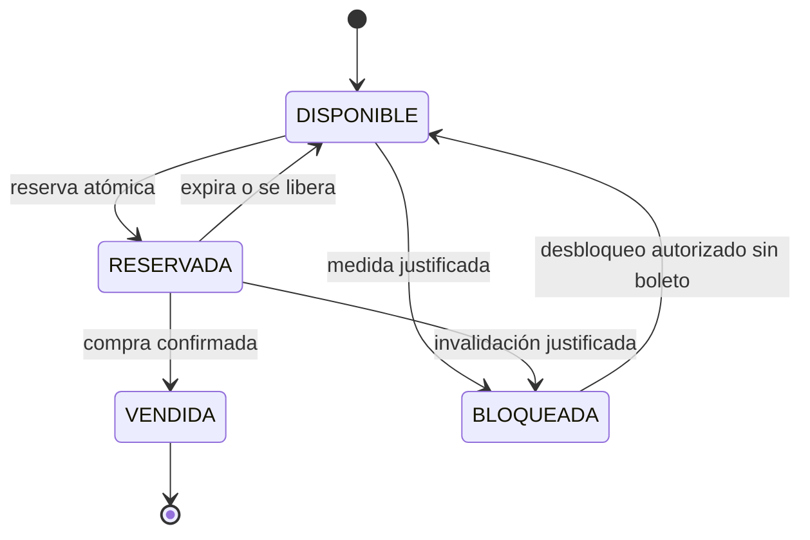
```mermaid
stateDiagram-v2
    [*] --> DISPONIBLE
    DISPONIBLE --> RESERVADA: reserva atómica
    RESERVADA --> VENDIDA: compra confirmada
    RESERVADA --> DISPONIBLE: expira o se libera
    DISPONIBLE --> BLOQUEADA: medida justificada
    RESERVADA --> BLOQUEADA: invalidación justificada
    BLOQUEADA --> DISPONIBLE: desbloqueo autorizado sin boleto
    VENDIDA --> [*]
```

Invariantes:

- `UNIQUE(draw_event_id, normalized_key)`.
- Solo una reserva activa por combinación.
- `VENDIDA` es terminal aunque el evento se cancele; el boleto pasa a reembolsado y la historia no se reescribe.
- El desbloqueo exige que no exista boleto.

Referencias: `LOT-EVT-001`, `LOT-EVT-003`, `LOT-EVT-004`, `LOT-EVT-005`, `LOT-EVT-016`, `LOT-EVT-020`.

## 5.5 Máquina `EVT-RES` — Reserva oficial

Estados:

- `ACTIVA`
- `CONSUMIDA`
- `EXPIRADA`
- `LIBERADA`
- `INVALIDADA_POR_CIERRE`
- `INVALIDADA_POR_CANCELACION`

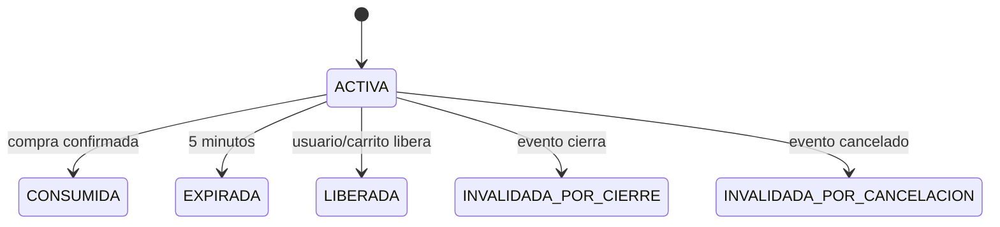
```mermaid
stateDiagram-v2
    [*] --> ACTIVA
    ACTIVA --> CONSUMIDA: compra confirmada
    ACTIVA --> EXPIRADA: 5 minutos
    ACTIVA --> LIBERADA: usuario/carrito libera
    ACTIVA --> INVALIDADA_POR_CIERRE: evento cierra
    ACTIVA --> INVALIDADA_POR_CANCELACION: evento cancelado
```

Solo `ACTIVA` cuenta para el límite del 20 %. Toda salida no consumida devuelve la combinación a `DISPONIBLE`, excepto cuando debe quedar `BLOQUEADA` por una incidencia.  
Referencias: `LOT-EVT-011`, `LOT-EVT-012`, `LOT-EVT-013`, `LOT-EVT-014`, `LOT-EVT-016`.

## 5.6 Sesión de compra y carrito

### Sesión

- `ACTIVA`
- `COMPLETADA`
- `EXPIRADA`
- `CERRADA_POR_EVENTO`

La sesión nunca extiende el cierre oficial.

### Carrito

- `ABIERTO`
- `CONFIRMADO`
- `EXPIRADO`
- `CANCELADO`
- `INVALIDADO_POR_EVENTO`

Una reserva expirada no obliga a eliminar reservas aún válidas del mismo carrito.  
Referencias: `LOT-EVT-011`, `LOT-EVT-015`, `LOT-GOV-005`.

## 5.7 Máquina `EVT-ORD` — Orden de compra

Estados:

- `PENDIENTE`
- `PROCESANDO`
- `CONFIRMADA`
- `RECHAZADA`
- `ERROR_REINTENTABLE`
- `REVISION_MANUAL`

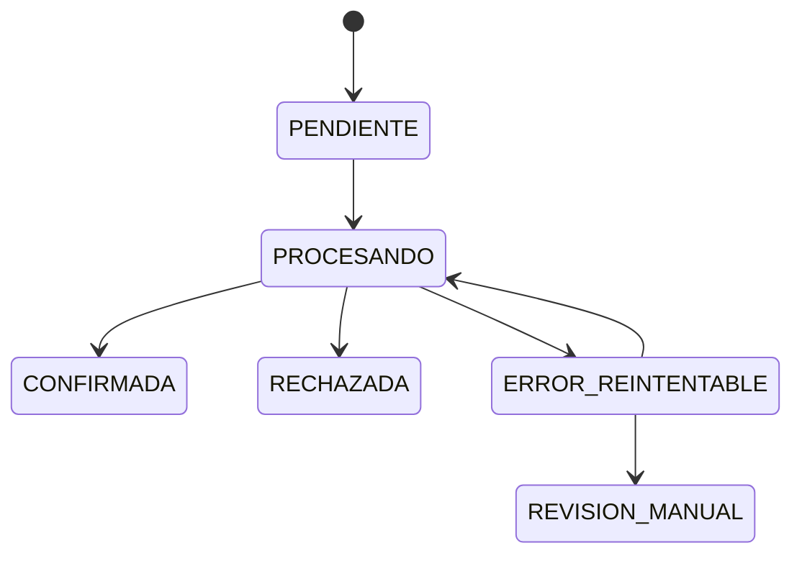
```mermaid
stateDiagram-v2
    [*] --> PENDIENTE
    PENDIENTE --> PROCESANDO
    PROCESANDO --> CONFIRMADA
    PROCESANDO --> RECHAZADA
    PROCESANDO --> ERROR_REINTENTABLE
    ERROR_REINTENTABLE --> PROCESANDO
    ERROR_REINTENTABLE --> REVISION_MANUAL
```

`CONFIRMADA` debe producir en la misma transacción:

- Débito VIRTUAL.
- Crédito al fondo/cuenta del evento.
- Boleto inmutable.
- Reserva `CONSUMIDA`.
- Combinación `VENDIDA`.
- Respuesta idempotente persistida.

Referencias: `LOT-EVT-012`, `LOT-EVT-014`, `LOT-EVT-016`, `LOT-GOV-003`.

## 5.8 Máquina `EVT-TKT` — Boleto

No debe usarse un solo `status` para mezclar propiedad, evaluación y pago. Se separan tres dimensiones.

### A. Estado de propiedad

- `ACTIVO`
- `REEMBOLSADO`
- `ANULADO_POR_CORRECCION`

Transiciones:

- `ACTIVO → REEMBOLSADO`: cancelación o causa autorizada.
- `ACTIVO → ANULADO_POR_CORRECCION`: solo con compensación y auditoría.

### B. Estado de evaluación

- `PENDIENTE_RESULTADO`
- `NO_PREMIADO`
- `DEVOLUCION`
- `GANADOR_MAYOR`

### C. Estado de acreditación

- `NO_APLICA`
- `PENDIENTE`
- `ACREDITANDO`
- `ACREDITADO`
- `ERROR_REINTENTABLE`
- `REVISION_MANUAL`

Esta separación permite representar correctamente:

- Boleto activo pendiente.
- Boleto no premiado sin pago.
- Boleto con devolución acreditada.
- Boleto ganador con pago pendiente.
- Boleto reembolsado sin ser reinterpretado como “no premiado”.

Referencias: `LOT-EVT-017`, `LOT-EVT-018`, `LOT-PRZ-001`, `LOT-PRZ-002`, `LOT-PRZ-016`, `LOT-PRZ-017`.

---

# 6. Premios, resultados y fondos oficiales

## 6.1 Máquina `PRZ-FND` — Reserva del fondo de garantía

Estados:

- `PENDIENTE`
- `RESERVADA`
- `CONSUMIDA`
- `LIBERADA`
- `CANCELADA`

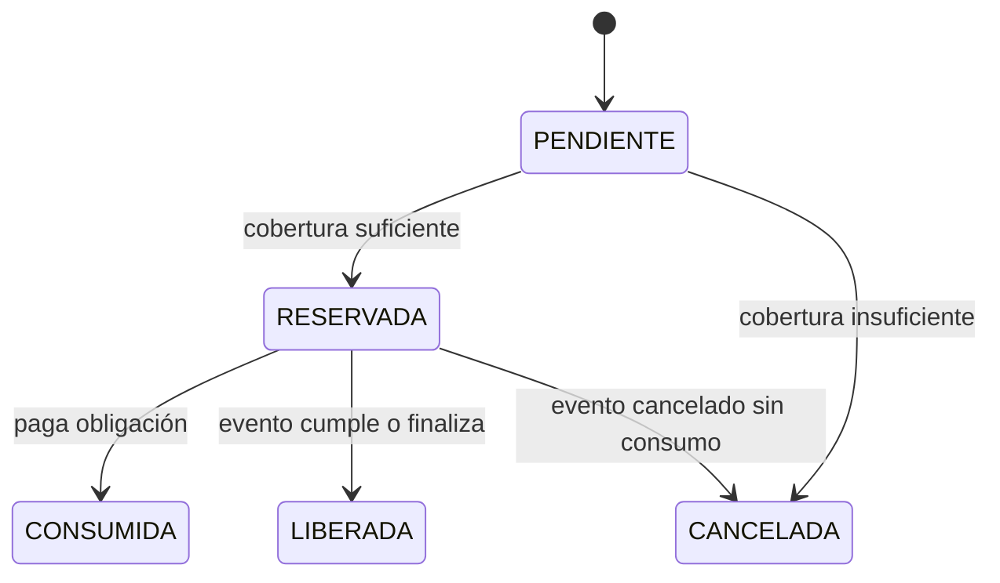
```mermaid
stateDiagram-v2
    [*] --> PENDIENTE
    PENDIENTE --> RESERVADA: cobertura suficiente
    PENDIENTE --> CANCELADA: cobertura insuficiente
    RESERVADA --> CONSUMIDA: paga obligación
    RESERVADA --> LIBERADA: evento cumple o finaliza
    RESERVADA --> CANCELADA: evento cancelado sin consumo
```

Guardas:

- Bloqueo de cuenta/fondo.
- El mismo saldo no respalda dos eventos.
- Publicación solo después de `RESERVADA`.

Referencias: `LOT-EVT-009`, `LOT-PRZ-004`, `LOT-PRZ-007`, `LOT-PRZ-008`.

## 6.2 Commitment oficial

Estados:

- `GENERADO_SECRETO`
- `PUBLICADO`
- `REVELADO`
- `INVALIDADO_POR_CANCELACION`

La semilla secreta permanece cifrada hasta la revelación. Un commitment cancelado se conserva, no se borra.  
Referencias: `LOT-PRZ-012`, `LOT-AUD-002`.

## 6.3 Snapshot oficial

Estados:

- `PENDIENTE`
- `GENERADO`
- `INVALIDADO_POR_CANCELACION`

No se modifica después de `GENERADO`.  
Referencias: `LOT-PRZ-013`, `LOT-EVT-019`.

## 6.4 Resultado oficial

El registro de resultado no necesita una máquina editable: se crea directamente como `FIJADO` dentro de una transacción protegida por unicidad. No existe `BORRADOR` persistido ni transición de regeneración.

Invariantes:

- Un resultado por evento.
- Cantidad y universo correctos.
- Sin reemplazo.
- Vinculado a commitment y snapshot.
- Inmutable.

Referencias: `LOT-PRZ-012`, `LOT-PRZ-013`, `LOT-PRZ-014`, `LOT-PRZ-015`.

## 6.5 Evaluación e informe

### Evaluación

La evaluación no introduce un enum de proceso adicional. Su ejecución se controla mediante `SYS-JOB` y su resultado autoritativo se representa por:

- la existencia única de `ticket_evaluations`;
- `tickets.evaluation_status`;
- la transición del evento `RESULTADO_FIJADO → PREMIOS_CALCULADOS`.

Un fallo técnico mantiene el job en `ESPERANDO_REINTENTO` o `REVISION_MANUAL`; no crea una evaluación parcial ni un segundo resultado.

### Informe

Estados persistidos en `result_reports.status`:

- `PENDIENTE`
- `PREPARADO`
- `PUBLICADO`
- `SUPERSEDED`
- `ERROR_REINTENTABLE`
- `REVISION_MANUAL`

El informe `PUBLICADO` debe coincidir con los premios y devoluciones calculados, tener una única versión pública vigente y no exponer identidad. Una corrección crea una versión nueva, marca la anterior `SUPERSEDED` y no vuelve a acreditar premios ya existentes; cualquier diferencia económica se corrige primero mediante ledger compensatorio.  
Referencias: `LOT-PRZ-016`, `LOT-PRZ-018`, `LOT-GOV-004`, `LOT-AUD-004`.

## 6.6 Máquina `PRZ-AWD` — Orden de premio o devolución

Estados definidos por el Plan Técnico:

- `CALCULADA`
- `PREPARADA`
- `ACREDITANDO`
- `ACREDITADA`
- `ERROR_REINTENTABLE`
- `REVISION_MANUAL`

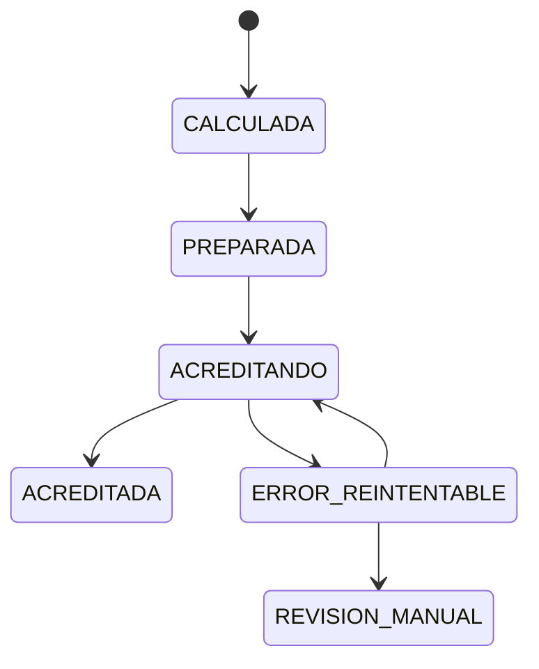
```mermaid
stateDiagram-v2
    [*] --> CALCULADA
    CALCULADA --> PREPARADA
    PREPARADA --> ACREDITANDO
    ACREDITANDO --> ACREDITADA
    ACREDITANDO --> ERROR_REINTENTABLE
    ERROR_REINTENTABLE --> ACREDITANDO
    ERROR_REINTENTABLE --> REVISION_MANUAL
```

Invariantes:

- `UNIQUE(event_id, ticket_id, award_category)`.
- `ACREDITADA` es terminal.
- Si el ledger existe y falla la proyección, se repara la proyección sin crear otra orden.
- La publicación del informe habilita la acreditación.

Referencias: `LOT-PRZ-016`, `LOT-PRZ-017`, `LOT-GOV-003`.

## 6.7 Acumulado

### Pool por producto

El pool mantiene saldo contable; no es una máquina de saldo manual.

### Transferencia de acumulado

Estados:

- `PENDIENTE_ASIGNACION`
- `ASIGNADA`
- `APLICADA`
- `DEVUELTA_AL_POOL`
- `CANCELADA`

| Transición | Regla |
|---|---|
| `PENDIENTE_ASIGNACION → ASIGNADA` | Se encuentra siguiente evento cronológico elegible del mismo producto. |
| `ASIGNADA → APLICADA` | El evento receptor incorpora el acumulado sin consumir su techo. |
| `ASIGNADA/APLICADA → DEVUELTA_AL_POOL` | El receptor se cancela antes del resultado. |

Referencias: `LOT-PRZ-009`, `LOT-PRZ-010`, `LOT-PRZ-011`.

---

# 7. Sorteos creados por usuarios

Este contexto usa saldo VIRTUAL y ledger global, pero mantiene estados separados de la lotería oficial. No hereda automáticamente límite 20 %, fondo de garantía oficial ni distribución 50/25/15/10.  
Referencias: `LOT-FIN-004`, `LOT-ORG-001` a `LOT-ORG-026`.

## 7.1 Máquina `ORG-DRW` — Sorteo de usuario

Estados:

- `BORRADOR`
- `PUBLICADO`
- `VENTAS_ABIERTAS`
- `VENTAS_CERRADAS`
- `CONGELADO`
- `RESULTADO_FIJADO`
- `ENTREGA_PENDIENTE`
- `FINALIZADO`
- `CANCELADO`
- `CERRADO_POR_INCUMPLIMIENTO`

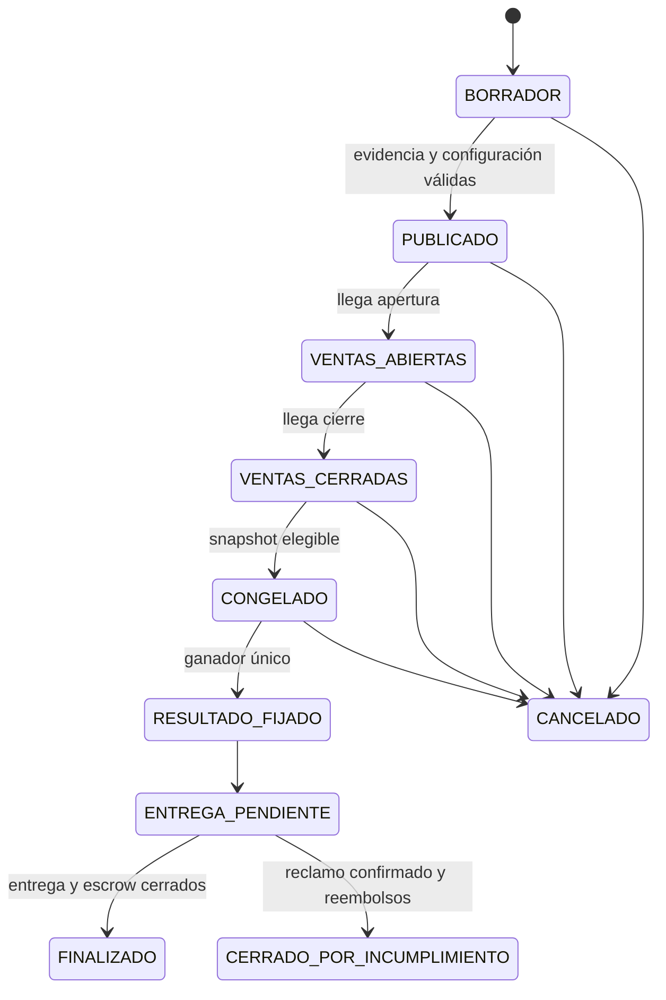
```mermaid
stateDiagram-v2
    [*] --> BORRADOR
    BORRADOR --> PUBLICADO: evidencia y configuración válidas
    PUBLICADO --> VENTAS_ABIERTAS: llega apertura
    VENTAS_ABIERTAS --> VENTAS_CERRADAS: llega cierre
    VENTAS_CERRADAS --> CONGELADO: snapshot elegible
    CONGELADO --> RESULTADO_FIJADO: ganador único
    RESULTADO_FIJADO --> ENTREGA_PENDIENTE
    ENTREGA_PENDIENTE --> FINALIZADO: entrega y escrow cerrados
    ENTREGA_PENDIENTE --> CERRADO_POR_INCUMPLIMIENTO: reclamo confirmado y reembolsos

    BORRADOR --> CANCELADO
    PUBLICADO --> CANCELADO
    VENTAS_ABIERTAS --> CANCELADO
    VENTAS_CERRADAS --> CANCELADO
    CONGELADO --> CANCELADO
```

| Transición | Guardas | Efectos | Reglas |
|---|---|---|---|
| `TR-ORG-DRW-001` | Cuenta `ACTIVO`. | Crear sorteo y capacidad contextual de Organizador. | `LOT-ORG-001`, `LOT-IAM-001` |
| `TR-ORG-DRW-002` | Premio/producto, rango, precio, visibilidad, apertura, cierre y evidencia válidos. | Publicar y congelar la configuración aplicable. | `LOT-ORG-002`, `LOT-ORG-003`, `LOT-ORG-023` |
| `TR-ORG-DRW-003` | Hora oficial de apertura alcanzada. | Habilitar participaciones y códigos válidos. | `LOT-ORG-003`, `LOT-GOV-005` |
| `TR-ORG-DRW-004` | Hora oficial de cierre alcanzada. | Rechazar cambios, compras y abandonos nuevos. | `LOT-ORG-017`, `LOT-ORG-019`, `LOT-ORG-022` |
| `TR-ORG-DRW-005` | Participaciones resueltas. | Congelar una entrada por cada asignación de número `ACTIVA` cuya participación esté `PAGADO` y con elegibilidad `ACTIVA`; publicar hash. | `LOT-ORG-022` |
| `TR-ORG-DRW-006` | No existe resultado y el snapshot es válido. | Ejecutar CSPRNG sobre las entradas y fijar una asignación/número ganador perteneciente al snapshot. | `LOT-ORG-022`, `LOT-GOV-003` |

La evidencia de `ORG-DRW` valida integridad de snapshot y resultado mediante hashes, versión de algoritmo, job y correlación. No reutiliza el commitment/semilla revelada de la lotería oficial.
| `TR-ORG-DRW-007` | Resultado fijado. | Crear proceso de entrega y mantener escrow retenido. | `LOT-ORG-023`, `LOT-ORG-025` |
| `TR-ORG-DRW-008` | Entrega confirmada o resolución administrativa firme que autoriza la liquidación. | Liberar el 95 %, devengar el 5 % y pasar a `FINALIZADO`. | `LOT-ORG-023`, `LOT-ORG-025` |
| `TR-ORG-DRW-009` | Antes de resultado, motivo y actor válidos. | Reembolsar 100 %, revertir comisión proporcional y conservar historia. | `LOT-ORG-008` |
| `TR-ORG-DRW-010` | Administrador confirma incumplimiento. | Bloquear o cancelar la liquidación, ordenar reembolsos/compensaciones y pasar a `CERRADO_POR_INCUMPLIMIENTO`. | `LOT-ORG-020`, `LOT-ORG-021`, `LOT-ORG-023`, `LOT-ORG-025` |

**Inmutabilidad tras el primer pago:** no es un estado separado. Es un invariante `has_confirmed_payment = true` que bloquea precio, premio, visibilidad, adjudicación, fechas y rango publicado. Solo permite anuncios y ampliación válida antes del cierre.  
Referencias: `LOT-ORG-004`, `LOT-ORG-024`.

## 7.2 Participación: no usar un único estado

Las reglas de abandono pagado requieren que una persona deje la comunidad activa, pero que sus números sigan siendo elegibles. Una participación representa una unidad económica —compra directa o reclamación de código— y puede tener una o varias asignaciones de número. Por ello, pago, relación, elegibilidad y asignaciones se modelan por separado.

### A. Estado de pago

- `PENDIENTE`
- `PAGADO`
- `REEMBOLSANDO`
- `REEMBOLSADO`
- `FALLIDO`

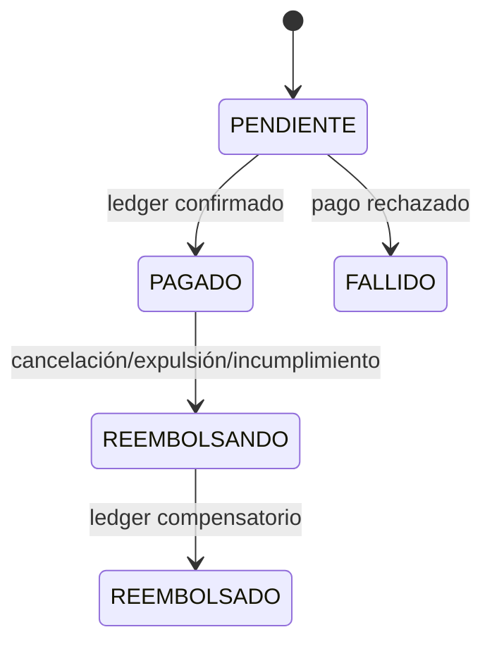
```mermaid
stateDiagram-v2
    [*] --> PENDIENTE
    PENDIENTE --> PAGADO: ledger confirmado
    PENDIENTE --> FALLIDO: pago rechazado
    PAGADO --> REEMBOLSANDO: cancelación/expulsión/incumplimiento
    REEMBOLSANDO --> REEMBOLSADO: ledger compensatorio
```

### B. Estado de relación con el sorteo

- `ACTIVO`
- `ABANDONO_REGISTRADO`
- `EXPULSADO`

### C. Estado de elegibilidad

- `NO_ELEGIBLE`
- `ACTIVA`
- `EXCLUIDA`

### D. Estado global del número

- `RESERVADA`
- `ASIGNADA`
- `LIBERADA`
- `BLOQUEADA`

### E. Estado de la asignación participación↔número

- `ACTIVA`
- `REEMPLAZADA`
- `LIBERADA`

Una participación directa tiene normalmente una asignación `ACTIVA`. Un código grupal puede crear varias. Cada asignación activa aporta una entrada independiente al snapshot, sin multiplicar el precio total de la participación.

La fila `user_draw_numbers` es el punto de exclusión: un número no puede estar a la vez reservado por un código y asignado activamente a una participación. Emisión, reclamación, cambio, expiración y liberación bloquean esa fila.

Combinaciones válidas importantes:

| Pago | Relación | Elegibilidad | Resultado |
|---|---|---|---|
| `PENDIENTE` | `ACTIVO` | `NO_ELEGIBLE` | Reserva temporal, no entra al snapshot. |
| `PAGADO` | `ACTIVO` | `ACTIVA` | Participación normal; cada asignación de número `ACTIVA` entra al snapshot. |
| `PAGADO` | `ABANDONO_REGISTRADO` | `ACTIVA` | No hay reembolso; todas sus asignaciones activas siguen participando. |
| `REEMBOLSADO` | `EXPULSADO` | `EXCLUIDA` | Número liberado antes del cierre. |
| `REEMBOLSADO` | `ACTIVO` | `EXCLUIDA` | Cancelación o incumplimiento. |

Referencias: `LOT-ORG-006`, `LOT-ORG-017`, `LOT-ORG-018`, `LOT-ORG-019`, `LOT-ORG-022`.

## 7.3 Cambios de número y compras adicionales

Una operación de cambio tiene estados:

- `SOLICITADA`
- `CONFIRMADA`
- `RECHAZADA`

`CONFIRMADA` debe:

- Verificar hora anterior al cierre.
- Identificar una asignación `ACTIVA` concreta de la participación.
- Bloquear la asignación anterior, el número anterior y el nuevo.
- Exigir nuevo número disponible.
- Marcar la asignación anterior `REEMPLAZADA` y crear la nueva `ACTIVA` en la misma transacción.
- Conservar ambas asignaciones en historial sin modificar el precio total.

No hay máximo comercial global, pero sí rate limit, antifraude e idempotencia.  
Referencias: `LOT-ORG-004`, `LOT-ORG-016`, `LOT-ORG-017`, `LOT-AUD-006`.

## 7.4 Máquina `ORG-COD` — Código privado

Se separan tres dimensiones.

### A. Uso

- `EMITIDO`
- `RECLAMADO`
- `EXPIRADO`

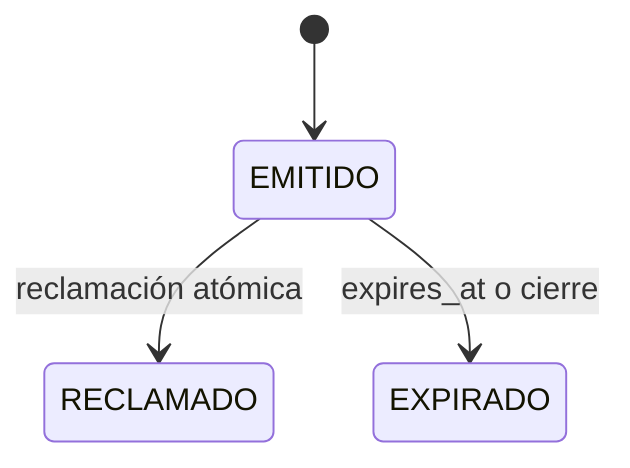
```mermaid
stateDiagram-v2
    [*] --> EMITIDO
    EMITIDO --> RECLAMADO: reclamación atómica
    EMITIDO --> EXPIRADO: expires_at o cierre
```

### B. Pago

- `PENDIENTE`
- `PAGADO`
- `REEMBOLSADO`
- `FALLIDO`

### C. Reserva vinculada

- `ACTIVA`
- `CONSUMIDA`
- `LIBERADA`

Reglas:

- El secreto se almacena mediante hash.
- `expires_at <= sales_close_at`.
- `EMITIDO` reserva el número o grupo.
- `RECLAMADO` consume la reserva una sola vez.
- `EXPIRADO` libera números atómicamente.
- La reclamación crea una participación económica y copia cada número reservado a una asignación participación↔número `ACTIVA`.
- El `price_virtual_minor` del código es total para el grupo, no por número.
- Si un código `PAGADO` se reclama, la participación creada queda `PAGADO` y referencia el mismo ledger; la reclamación no genera un segundo cobro.
- Si un código `PENDIENTE` se reclama, la participación permanece `PENDIENTE` y `NO_ELEGIBLE` hasta pagar antes del cierre.
- Un código pagado no reclamado al cierre se excluye y reembolsa a quien lo financió.
- El comentario no vincula identidad.

Referencias: `LOT-ORG-010` a `LOT-ORG-015`, `LOT-GOV-003`, `LOT-AUD-006`.

## 7.5 Máquina `ORG-CLM` — Reclamo

Estados normativos:

- `PRESENTADO`
- `EN_REVISION`
- `ESPERANDO_EVIDENCIA`
- `RESUELTO`
- `RECHAZADO`
- `APELADO`
- `CERRADO`

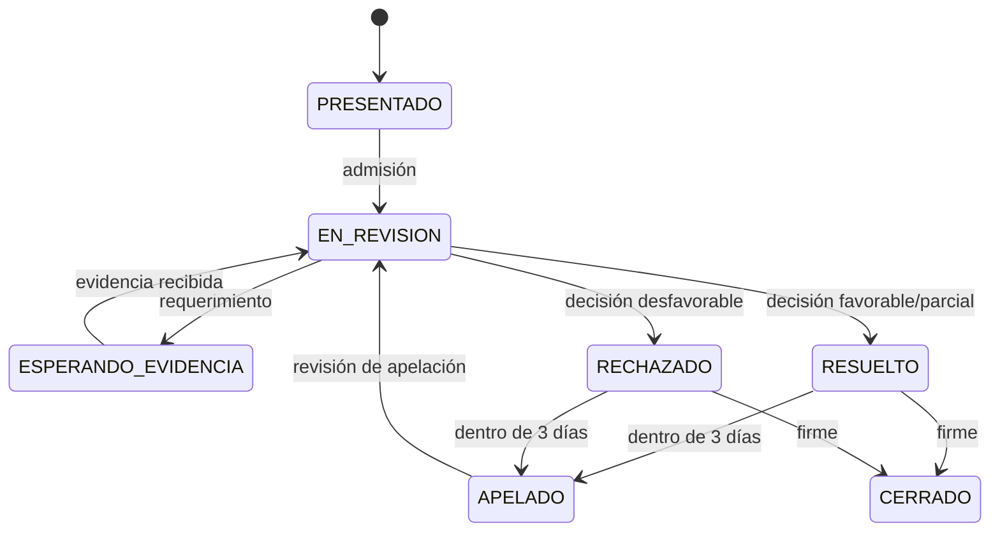
```mermaid
stateDiagram-v2
    [*] --> PRESENTADO
    PRESENTADO --> EN_REVISION: admisión
    EN_REVISION --> ESPERANDO_EVIDENCIA: requerimiento
    ESPERANDO_EVIDENCIA --> EN_REVISION: evidencia recibida
    EN_REVISION --> RESUELTO: decisión favorable/parcial
    EN_REVISION --> RECHAZADO: decisión desfavorable
    RESUELTO --> APELADO: dentro de 3 días
    RECHAZADO --> APELADO: dentro de 3 días
    APELADO --> EN_REVISION: revisión de apelación
    RESUELTO --> CERRADO: firme
    RECHAZADO --> CERRADO: firme
```

Guardas:

- Presentación ordinaria dentro de 7 días calendario.
- Reapertura tardía solo por Administrador con motivo.
- Organizador aporta evidencia, pero no resuelve.
- Resolución y compensaciones quedan inmutables; una apelación crea una fase nueva.
- Objetivo operativo: 5 días hábiles, sin resolución automática por excederlo.

Referencias: `LOT-ORG-020`, `LOT-ORG-021`, `LOT-AUD-001`, `LOT-AUD-003`.

## 7.6 Máquina `ORG-DLV` — Entrega del premio

Estados:

- `PENDIENTE`
- `REGISTRADA_POR_ORGANIZADOR`
- `CONFIRMADA_POR_GANADOR`
- `EN_RECLAMO`
- `INCUMPLIMIENTO_CONFIRMADO`
- `CERRADA`

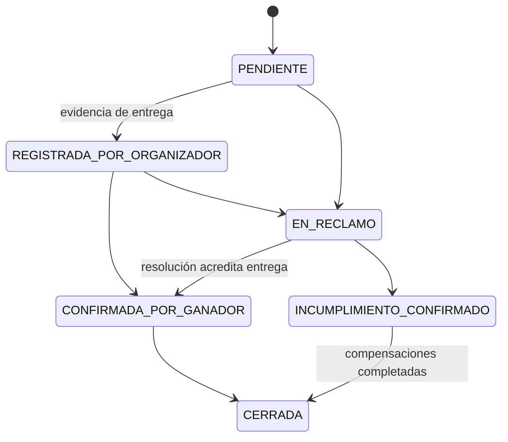
```mermaid
stateDiagram-v2
    [*] --> PENDIENTE
    PENDIENTE --> REGISTRADA_POR_ORGANIZADOR: evidencia de entrega
    REGISTRADA_POR_ORGANIZADOR --> CONFIRMADA_POR_GANADOR
    PENDIENTE --> EN_RECLAMO
    REGISTRADA_POR_ORGANIZADOR --> EN_RECLAMO
    EN_RECLAMO --> CONFIRMADA_POR_GANADOR: resolución acredita entrega
    EN_RECLAMO --> INCUMPLIMIENTO_CONFIRMADO
    CONFIRMADA_POR_GANADOR --> CERRADA
    INCUMPLIMIENTO_CONFIRMADO --> CERRADA: compensaciones completadas
```

La plataforma no custodia físicamente el premio en el MVP. La evidencia es requisito para publicar y para resolver la entrega.  
Referencias: `LOT-ORG-023`, `LOT-ORG-020`, `LOT-ORG-021`.

## 7.7 Máquina `ORG-ESC` — Custodia y liquidación del 95 %

Estados:

- `RETENIDA`
- `LIBERABLE`
- `EN_DISPUTA`
- `LIBERANDO`
- `LIBERADA`
- `REEMBOLSO_ORDENADO`
- `REEMBOLSANDO`
- `REEMBOLSADA`

```mermaid
stateDiagram-v2
    [*] --> RETENIDA
    RETENIDA --> LIBERABLE: resultado + entrega confirmada
    RETENIDA --> EN_DISPUTA: reclamo
    EN_DISPUTA --> LIBERABLE: resolución permite liquidación
    EN_DISPUTA --> REEMBOLSO_ORDENADO: incumplimiento
    LIBERABLE --> LIBERANDO
    LIBERANDO --> LIBERADA
    REEMBOLSO_ORDENADO --> REEMBOLSANDO
    REEMBOLSANDO --> REEMBOLSADA
```

Invariantes:

- El 5 % y el 95 % se registran separados.
- `RETENIDA`, `EN_DISPUTA` y `REEMBOLSO_ORDENADO` no son saldo disponible del Organizador.
- La liberación o el reembolso ocurren una sola vez.
- `LIBERADA` y `REEMBOLSADA` son terminales y mutuamente excluyentes.
- Una compensación posterior a `LIBERADA` no reabre ni sobregira el escrow; usa una operación contable separada conforme a `LOT-ORG-025`.
- Cancelación o expulsión reembolsable revierte la comisión proporcional mientras los importes permanezcan retenidos.
- Error de plataforma no reduce el reembolso o la compensación del participante.

Referencias: `LOT-ORG-006`, `LOT-ORG-008`, `LOT-ORG-018`, `LOT-ORG-023`, `LOT-ORG-025`.

## 7.8 Exclusión de identidad avanzada

La verificación automática de cédula no tiene estados operativos en el MVP. Puede existir una capacidad genérica deshabilitada, pero no un flujo que recopile imágenes o valide documentos automáticamente.

Referencia: `LOT-ORG-026`.

---

# 8. Trabajos asíncronos y recuperación

## 8.1 Máquina `SYS-JOB`

Estados:

- `PROGRAMADO`
- `EJECUTANDO`
- `COMPLETADO`
- `ESPERANDO_REINTENTO`
- `REVISION_MANUAL`
- `CANCELADO`
- `SIN_EFECTO_IDEMPOTENTE`

```mermaid
stateDiagram-v2
    [*] --> PROGRAMADO
    PROGRAMADO --> EJECUTANDO
    EJECUTANDO --> COMPLETADO
    EJECUTANDO --> ESPERANDO_REINTENTO
    ESPERANDO_REINTENTO --> EJECUTANDO
    ESPERANDO_REINTENTO --> REVISION_MANUAL
    PROGRAMADO --> CANCELADO
    EJECUTANDO --> SIN_EFECTO_IDEMPOTENTE: efecto ya existe
```

Aplicable a:

- Expiración de reservas.
- Fallback de solicitudes.
- Apertura/cierre de eventos.
- Congelación y snapshot.
- Generación de resultados.
- Evaluación.
- Publicación de informes.
- Acreditación de premios.
- Reembolsos.
- Distribución de fondos.
- Expiración de códigos.
- Reconciliación.

Referencias: `LOT-AUD-004`, `LOT-GOV-003`, `LOT-GOV-005`.

## 8.2 Regla de reintento

Un reintento:

- Usa el mismo identificador lógico o clave idempotente.
- Relee el estado desde PostgreSQL.
- No asume que el intento anterior falló antes del `COMMIT`.
- Termina en `SIN_EFECTO_IDEMPOTENTE` cuando el efecto ya existe.
- Pasa a `REVISION_MANUAL` al agotar reintentos.
- Nunca regenera un resultado ya fijado.

Referencias: `LOT-GOV-002`, `LOT-GOV-003`, `LOT-PRZ-014`, `LOT-PRZ-017`.

---

# 9. Algoritmo obligatorio de transición

Toda transición crítica debe seguir el patrón:

```text
BEGIN TRANSACTION

1. Resolver actor, sesión, modo y permisos.
2. Cargar entidad autoritativa desde PostgreSQL.
3. Bloquear filas necesarias con estrategia definida.
4. Verificar estado actual permitido.
5. Verificar guardas de negocio y hora oficial.
6. Resolver clave de idempotencia.
7. Crear asientos, entidades y efectos dependientes.
8. Actualizar estado actual.
9. Insertar historial de transición.
10. Insertar auditoría y outbox.
11. Persistir respuesta idempotente.

COMMIT
```

Si cualquier paso falla, no debe quedar un estado parcial.

Referencias: `LOT-GOV-001`, `LOT-GOV-002`, `LOT-GOV-003`, `LOT-FIN-005`, `LOT-AUD-001`, `LOT-AUD-005`.

## 9.1 Códigos de error mínimos

| Código | HTTP sugerido | Uso |
|---|---:|---|
| `INVALID_STATE_TRANSITION` | 409 | El estado actual no permite el comando. |
| `ENTITY_ALREADY_FINALIZED` | 409 | La entidad ya está en estado terminal. |
| `IDEMPOTENCY_KEY_CONFLICT` | 409 | Misma clave con cuerpo diferente. |
| `CONCURRENT_STATE_CHANGE` | 409 | Otra transacción ganó la carrera. |
| `OPERATION_WINDOW_CLOSED` | 409 | Hora oficial fuera de ventana. |
| `INSUFFICIENT_AVAILABLE_BALANCE` | 409 | Saldo disponible insuficiente. |
| `RESOURCE_NOT_AVAILABLE` | 409 | Número, combinación o código ya no disponible. |
| `PERMISSION_DENIED` | 403 | Rol, modo, permiso o propiedad insuficiente. |
| `REASON_REQUIRED` | 422 | Acción administrativa sin motivo. |
| `MANUAL_REVIEW_REQUIRED` | 409 | Flujo detenido para intervención autorizada. |

## 9.2 Respuesta de conflicto

```json
{
  "status": 409,
  "code": "INVALID_STATE_TRANSITION",
  "message": "La operación no es válida para el estado actual.",
  "correlationId": "uuid",
  "details": {
    "entity": "draw_event",
    "currentStatus": "RESULTADO_FIJADO",
    "requestedTransition": "TR-EVT-011"
  }
}
```

La respuesta no debe revelar datos sensibles.

---

# 10. Persistencia recomendada antes del SQL

## 10.1 Estado actual más historial

Para cada agregado crítico:

- Una columna de estado actual para consultas y guardas.
- Una tabla de historial append-only.
- Restricciones de unicidad para estados terminales o efectos únicos.
- `version` o control optimista cuando ayude, sin sustituir locks críticos.
- `created_at`, `updated_at` y fecha efectiva de cada transición.
- `correlation_id` e idempotencia.

## 10.2 Máquinas que requieren historial específico

| Agregado | Historial mínimo |
|---|---|
| Cuenta | Cambios de estado, actor y motivo. |
| Solicitud REAL→VIRTUAL | Creación, asignación, liberación y finalización. |
| Evento oficial | Todas las fases y cancelación. |
| Combinación/reserva | Reserva, expiración, venta y bloqueo. |
| Orden y boleto | Procesamiento, confirmación, evaluación, pago o reembolso. |
| Premio | Cálculo, intento, acreditación y revisión. |
| Sorteo de usuario | Publicación, cierre, resultado, cancelación y finalización. |
| Participación | Pago, número, abandono, expulsión, elegibilidad y reembolso. |
| Código | Emisión, reclamación, expiración y pago. |
| Reclamo | Estados, evidencias, decisiones, apelación y compensación. |
| Entrega/escrow | Evidencia, disputa, liberación o reembolso. |
| Job | Intentos, errores, reintentos y resultado. |

## 10.3 No usar borrado físico

No se borran físicamente estados o entidades con:

- Asientos.
- Boletos.
- Participaciones.
- Códigos.
- Resultados.
- Premios.
- Reclamos.
- Expulsiones.
- Historial administrativo.

Referencias: `LOT-IAM-009`, `LOT-EVT-017`, `LOT-ORG-009`, `LOT-GOV-004`.

---

# 11. Transiciones expresamente prohibidas

| Entidad | Transición prohibida | Justificación |
|---|---|---|
| Cuenta | `DESACTIVADO → ACTIVO` en MVP | No existe regla de reactivación aprobada. |
| Ledger | Editar `CONTABILIZADA` | Se usa compensación. |
| Solicitud | Cualquier terminal → no terminal | Finalización única. |
| Evento oficial | `PUBLICADO → BORRADOR` | Evento publicado inmutable. |
| Evento oficial | `RESULTADO_FIJADO → CANCELADO` | No procede cancelación ordinaria. |
| Combinación | `VENDIDA → DISPONIBLE` | Conserva propiedad e historial. |
| Reserva | Estado terminal → `ACTIVA` | Crear una reserva nueva, no revivir. |
| Boleto | `REEMBOLSADO → ACTIVO` | Corrección mediante nueva operación documentada. |
| Resultado | `FIJADO → regenerado/editado` | Resultado único e inmutable. |
| Premio | `ACREDITADA → ACREDITANDO` | Impedir doble pago. |
| Sorteo de usuario | Estado posterior a resultado → cancelación ordinaria | Debe resolverse mediante entrega/reclamo/compensación. |
| Código | `RECLAMADO → EMITIDO` | Un solo uso. |
| Código | `EXPIRADO → RECLAMADO` | Uso fuera de plazo. |
| Reclamo | `CERRADO → EN_REVISION` sin reapertura administrativa | Reapertura requiere motivo y auditoría. |
| Escrow | `LIBERADA → RETENIDA` | Cualquier corrección usa transacción compensatoria. |

---

# 12. Pruebas obligatorias por máquina

## 12.1 Concurrencia

- Dos clientes reservan la misma combinación: una transición a `RESERVADA`.
- Dos compras confirman la misma combinación: una orden `CONFIRMADA`.
- Dos vendedores toman la misma solicitud: una asignación `ACTIVA`.
- Vendedor y plataforma completan al minuto cinco: un estado terminal.
- Dos workers fijan resultado: un registro `FIJADO`.
- Dos procesos acreditan premio: una orden `ACREDITADA`.
- Dos cuentas reclaman un código: una transición `RECLAMADO`.
- Dos procesos liberan escrow: una transición terminal.

Referencias: `LOT-EVT-001`, `LOT-VND-005`, `LOT-VND-010`, `LOT-PRZ-014`, `LOT-PRZ-016`, `LOT-ORG-013`, `LOT-ORG-025`.

## 12.2 Tiempo

- Reserva antes, en y después de cinco minutos, incluida una reserva creada a menos de cinco minutos del cierre.
- Compra antes y después del cierre oficial.
- Liberación del 20 % en los tres rangos de redondeo y clamp cuando el resultado cae fuera de la ventana.
- Fallback exactamente a creación + cinco minutos.
- Código antes, en y después de `expires_at`.
- Cambio, abandono y expulsión antes/después del cierre.
- Reclamo y apelación dentro/fuera de plazo.

Referencias: `LOT-GOV-005`, `LOT-EVT-010` a `LOT-EVT-014`, `LOT-VND-006`, `LOT-VND-009`, `LOT-ORG-015`, `LOT-ORG-017` a `LOT-ORG-021`.

## 12.3 Terminalidad e idempotencia

- Repetir cancelación no duplica reembolsos.
- Repetir conversión no duplica ledger.
- Reintentar premio repara proyección sin segundo premio.
- Reintentar resultado devuelve el existente.
- Repetir expiración de reserva o código no libera dos veces.
- Repetir liquidación del escrow no acredita dos veces.

Referencias: `LOT-GOV-003`, `LOT-PRZ-017`, `LOT-ORG-008`, `LOT-ORG-015`, `LOT-ORG-025`.

## 12.4 Auditoría

Cada prueba crítica debe verificar:

- Estado anterior y nuevo.
- Actor/proceso.
- Hora oficial.
- Motivo cuando corresponde.
- `correlation_id`.
- Transacción contable vinculada.
- Ausencia de secretos en logs.

Referencias: `LOT-AUD-001`, `LOT-AUD-002`, `LOT-AUD-003`, `LOT-AUD-008`.

---

# 13. Matriz de trazabilidad resumida

| Máquina | Reglas principales |
|---|---|
| Cuenta/sesión | `LOT-IAM-001` a `LOT-IAM-009` |
| Libro y wallets | `LOT-FIN-001` a `LOT-FIN-012` |
| Vendedores/solicitudes | `LOT-VND-001` a `LOT-VND-010` |
| Evento oficial | `LOT-EVT-001` a `LOT-EVT-020` |
| Premio/resultado/fondos | `LOT-PRZ-001` a `LOT-PRZ-018` |
| Sorteos de usuario | `LOT-ORG-001` a `LOT-ORG-026`, excepto ID reservado `LOT-ORG-005` |
| Auditoría y ejecución | `LOT-AUD-001` a `LOT-AUD-009` |
| Principios transversales | `LOT-GOV-001` a `LOT-GOV-008` |

La matriz detallada regla→tabla→endpoint→prueba se completará en el diccionario de datos y la estrategia de pruebas, sin cambiar estas transiciones.

---

# 14. Consistencia con los documentos fuente

## 14.1 Plan Técnico

Este documento desarrolla y precisa las máquinas resumidas en el Anexo C del Plan Técnico:

- Evento oficial.
- Combinación y reserva.
- Solicitud REAL→VIRTUAL.
- Premio.

Además incorpora las máquinas necesarias para identidad, finanzas, trabajos y sorteos creados por usuarios.

## 14.2 README

El README final queda sincronizado con esta baseline:

- reconoce que `PEND-ORG-001` a `PEND-ORG-010` están resueltos o excluidos formalmente;
- identifica el módulo `user_draws` como contexto separado;
- mantiene PostgreSQL y el ledger como fuentes de verdad;
- conserva el carácter simulado de los saldos;
- enlaza los cinco contratos documentales aprobados.

## 14.3 Regla de no deformación

Si el diseño SQL necesita una transición no incluida aquí:

1. Identificar la regla afectada.
2. Crear o modificar una regla `LOT-*`.
3. Aprobar el cambio documental.
4. Actualizar este documento.
5. Solo entonces crear la migración.

Referencia: `LOT-AUD-009`.

---

# 15. Criterios de aprobación

La revisión final confirma:

- [x] Cada estado tiene nombre único y significado no ambiguo.
- [x] Cada transición tiene reglas `LOT-*` asociadas.
- [x] Los estados terminales están identificados.
- [x] Lotería oficial y sorteos de usuario permanecen separados.
- [x] Abandono pagado no elimina elegibilidad.
- [x] Expulsión reembolsable libera el número antes del cierre.
- [x] La comisión y el escrow usan estados separados.
- [x] Ninguna transición permite doble efecto financiero.
- [x] El resultado oficial y el de usuario son únicos e inmutables.
- [x] Las cancelaciones anteriores al resultado generan devolución íntegra.
- [x] La hora del servidor controla cierres y expiraciones.
- [x] Las pruebas de concurrencia y estados terminales están planificadas.
- [x] El README se sincroniza con la resolución de `PEND-ORG-*`.
- [x] La siguiente fase usa estas máquinas en `MATRIZ-DE-PERMISOS.md`, `FLUJOS-FINANCIEROS.md` y `DICCIONARIO-DE-DATOS.md`.

---

# 16. Decisión de salida de fase

Con este documento aprobado queda permitido:

- Definir permisos por transición.
- Diseñar flujos financieros y asientos.
- Crear el diccionario de datos.
- Diseñar tablas de estado e historial.
- Preparar el modelo Prisma y SQL.

No queda permitido durante la implementación v1:

- Crear migraciones finales que contradigan estas máquinas.
- Omitir historial para entidades críticas.
- Tratar estados derivados como fuente de verdad.
- Revivir registros terminales mediante `UPDATE`.
- Incorporar verificación automática con cédula en el MVP.

> **Decisión obligatoria:** El SQL debe implementar estas máquinas; no debe redefinirlas.


# 17. Declaración de congelamiento

Esta máquina de estados es la baseline final de la versión 1. Los nombres, transiciones, estados terminales y efectos aquí definidos no pueden alterarse para simplificar Prisma, SQL, NestJS, web o mobile.

Las decisiones técnicas que no cambien el significado del dominio —por ejemplo, estrategia de particionado o proveedor de colas— pueden resolverse en implementación. Cualquier transición nueva pertenece a una versión futura y exige actualizar primero `REGLAS-NEGOCIO.md`.
